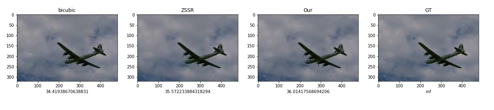
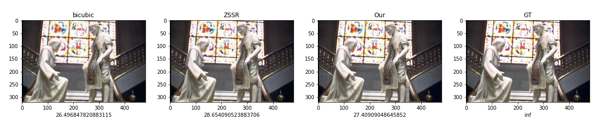

# [Zero-Shot-Super-Resolution](https://arxiv.org/abs/1712.06087)

## Comparison of result with Original work
### Configuration:
- SR factor = 2
- ML library: PyTorch
- Number of epochs: 1000
- Number of layers in Net: 4
- Noise Std: 0.04
- Crop size: 96
- Time spent: 40 sec (On Google Colab GPU)
- Enhanced prediction (Averaging results): None

### Result

