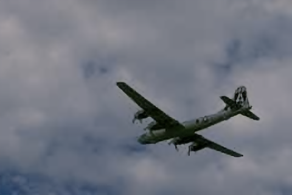
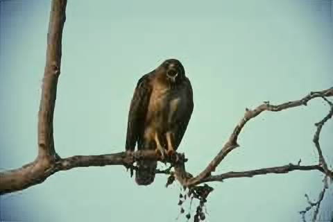
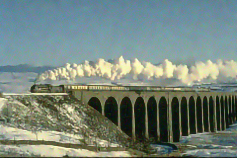
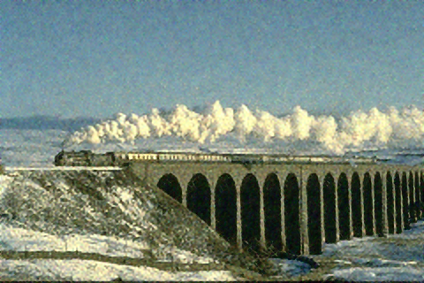
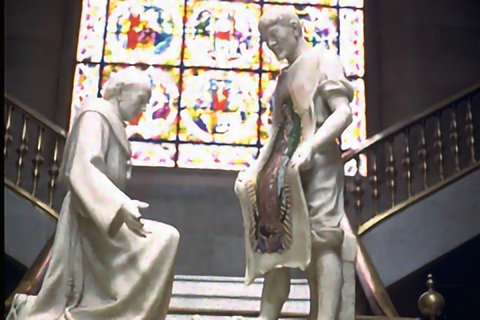
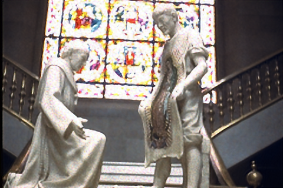
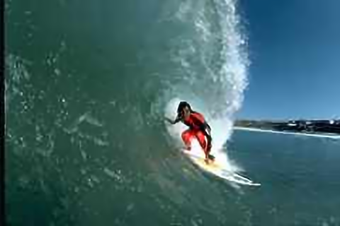
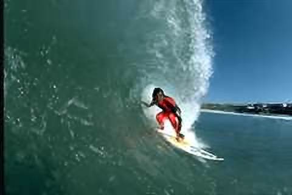
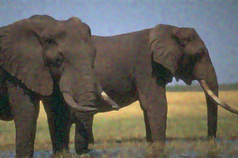
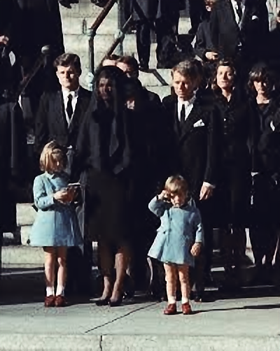

### Our Configuration
- SR factor = 2
- ML library: PyTorch
- Number of epochs: 1000
- Number of layers in Net: 4
- Noise Std: 0.04
- Crop size: 96
- Time spent: 40 sec (On Google Colab GPU)
- Enhanced prediction (Averaging results): None

### Compare (PSNR)
|ZSSR|Ours|
|--|--|
||
|35.57|36.01|

|ZSSR|Ours|
|--|--|
||
|29.42|29.68|

|ZSSR|Ours|
|--|--|
||
|23.71|24.27|

|ZSSR|Ours|
|--|--|
||
|24.57|24.39|

|ZSSR|Ours|
|--|--|
||
|28.65|27.41|

|ZSSR|Ours|
|--|--|
||
|27.56|27.39|

|ZSSR|Ours|
|--|--|
||
|26.43|27.98|

|ZSSR|Ours|
|--|--|
||

|ZSSR|Ours|
|--|--|
||
